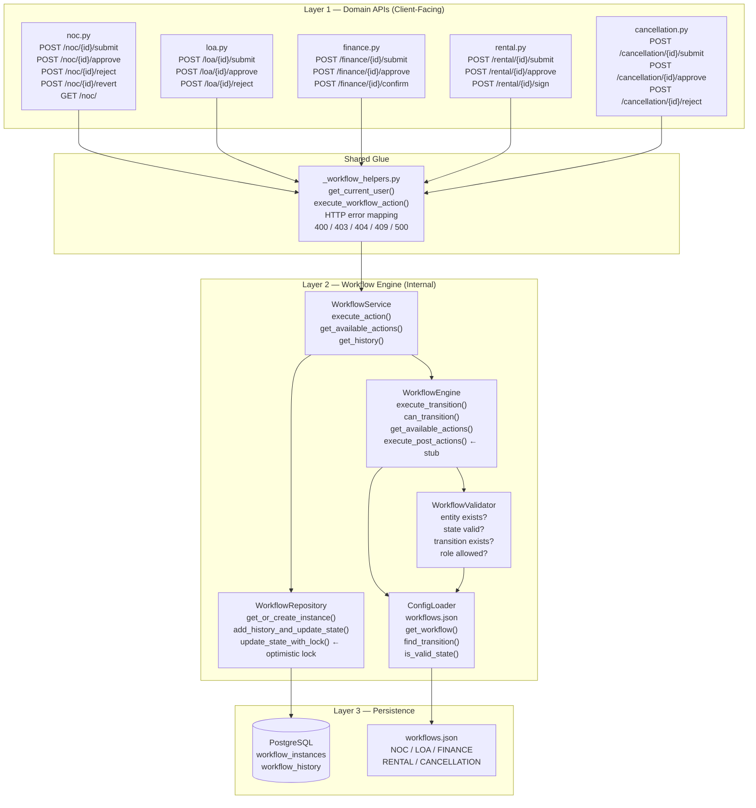

# Architecture — Component View

```mermaid
graph TD
    subgraph "Layer 1 — Domain APIs (Client-Facing)"
        NOC["noc.py\nPOST /noc/{id}/submit\nPOST /noc/{id}/approve\nPOST /noc/{id}/reject\nPOST /noc/{id}/revert\nGET  /noc/"]
        LOA["loa.py\nPOST /loa/{id}/submit\nPOST /loa/{id}/approve\nPOST /loa/{id}/reject"]
        FIN["finance.py\nPOST /finance/{id}/submit\nPOST /finance/{id}/approve\nPOST /finance/{id}/confirm"]
        REN["rental.py\nPOST /rental/{id}/submit\nPOST /rental/{id}/approve\nPOST /rental/{id}/sign"]
        CAN["cancellation.py\nPOST /cancellation/{id}/submit\nPOST /cancellation/{id}/approve\nPOST /cancellation/{id}/reject"]
    end

    subgraph "Shared Glue"
        HLP["_workflow_helpers.py\nget_current_user()\nexecute_workflow_action()\nHTTP error mapping\n400 / 403 / 404 / 409 / 500"]
    end

    subgraph "Layer 2 — Workflow Engine (Internal)"
        SVC["WorkflowService\nexecute_action()\nget_available_actions()\nget_history()"]
        ENG["WorkflowEngine\nexecute_transition()\ncan_transition()\nget_available_actions()\nexecute_post_actions() ← stub"]
        VAL["WorkflowValidator\nentity exists?\nstate valid?\ntransition exists?\nrole allowed?"]
        CFG["ConfigLoader\nworkflows.json\nget_workflow()\nfind_transition()\nis_valid_state()"]
        REP["WorkflowRepository\nget_or_create_instance()\nadd_history_and_update_state()\nupdate_state_with_lock() ← optimistic lock"]
    end

    subgraph "Layer 3 — Persistence"
        DB[("PostgreSQL\nworkflow_instances\nworkflow_history")]
        JSON["workflows.json\nNOC / LOA / FINANCE\nRENTAL / CANCELLATION"]
    end

    NOC & LOA & FIN & REN & CAN --> HLP
    HLP --> SVC
    SVC --> ENG
    SVC --> REP
    ENG --> VAL
    ENG --> CFG
    VAL --> CFG
    CFG --> JSON
    REP --> DB
```
