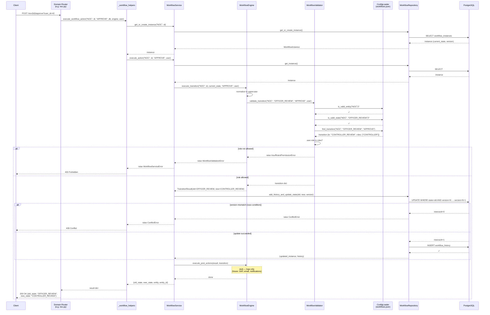

# Request Sequence — Executing an Action

Example: `POST /noc/{id}/approve?user_id=42`

```mermaid
sequenceDiagram
    participant C as Client
    participant R as Domain Router<br/>(e.g. noc.py)
    participant H as _workflow_helpers
    participant S as WorkflowService
    participant E as WorkflowEngine
    participant V as WorkflowValidator
    participant CF as ConfigLoader<br/>(workflows.json)
    participant Repo as WorkflowRepository
    participant DB as PostgreSQL

    C->>R: POST /noc/{id}/approve?user_id=42
    R->>H: execute_workflow_action("NOC", id, "APPROVE", db, engine, user)

    H->>S: get_or_create_instance("NOC", id)
    S->>Repo: get_or_create_instance()
    Repo->>DB: SELECT workflow_instances
    DB-->>Repo: instance (current_state, version)
    Repo-->>S: WorkflowInstance
    S-->>H: instance

    H->>S: execute_action("NOC", id, "APPROVE", user)
    S->>Repo: get_instance()
    Repo->>DB: SELECT
    DB-->>Repo: instance
    Repo-->>S: instance

    S->>E: execute_transition("NOC", id, current_state, "APPROVE", user)
    E->>E: normalize to uppercase
    E->>V: validate_transition("NOC", "OFFICER_REVIEW", "APPROVE", user)
    V->>CF: is_valid_entity("NOC")?
    CF-->>V: ✓
    V->>CF: is_valid_state("NOC", "OFFICER_REVIEW")?
    CF-->>V: ✓
    V->>CF: find_transition("NOC", "OFFICER_REVIEW", "APPROVE")
    CF-->>V: transition {to: "CONTROLLER_REVIEW", roles: ["CONTROLLER"]}
    V->>V: user.role in roles?

    alt role not allowed
        V-->>E: raise InsufficientPermissionError
        E-->>S: raise WorkflowValidationError
        S-->>H: raise WorkflowServiceError
        H-->>C: 403 Forbidden
    else role allowed
        V-->>E: transition dict
        E-->>S: TransitionResult(old=OFFICER_REVIEW, new=CONTROLLER_REVIEW)

        S->>Repo: add_history_and_update_state(old, new, version)
        Repo->>DB: UPDATE WHERE state=old AND version=N → version=N+1
        alt version mismatch (race condition)
            DB-->>Repo: rowcount=0
            Repo-->>S: raise ConflictError
            S-->>H: raise ConflictError
            H-->>C: 409 Conflict
        else update succeeded
            DB-->>Repo: rowcount=1
            Repo->>DB: INSERT workflow_history
            DB-->>Repo: ✓
            Repo-->>S: (updated_instance, history)
        end

        S->>E: execute_post_actions(result, transition)
        Note over E: stub — logs only<br/>(future: SAP, email, notifications)
        E-->>S: done

        S-->>H: {old_state, new_state, entity, entity_id}
        H-->>R: result dict
        R-->>C: 200 OK {old_state: "OFFICER_REVIEW",<br/>new_state: "CONTROLLER_REVIEW"}
    end
```
