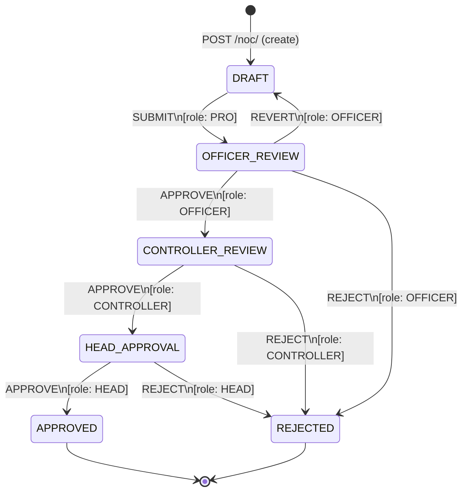

# State Machine — NOC Workflow

Sourced from `backend/app/workflow/config/workflows.json`.

## States

| State | Description |
|---|---|
| `DRAFT` | NOC created, pending PRO submission |
| `OFFICER_REVIEW` | Submitted, under Officer review |
| `CONTROLLER_REVIEW` | Officer approved, under Controller review |
| `HEAD_APPROVAL` | Controller approved, pending Head sign-off |
| `APPROVED` | Fully approved — terminal state |
| `REJECTED` | Rejected at any stage — terminal state |

## Transitions

| From | Action | To | Role Required |
|---|---|---|---|
| DRAFT | SUBMIT | OFFICER_REVIEW | PRO |
| OFFICER_REVIEW | APPROVE | CONTROLLER_REVIEW | OFFICER |
| OFFICER_REVIEW | REJECT | REJECTED | OFFICER |
| OFFICER_REVIEW | REVERT | DRAFT | OFFICER |
| CONTROLLER_REVIEW | APPROVE | HEAD_APPROVAL | CONTROLLER |
| CONTROLLER_REVIEW | REJECT | REJECTED | CONTROLLER |
| HEAD_APPROVAL | APPROVE | APPROVED | HEAD |
| HEAD_APPROVAL | REJECT | REJECTED | HEAD |
